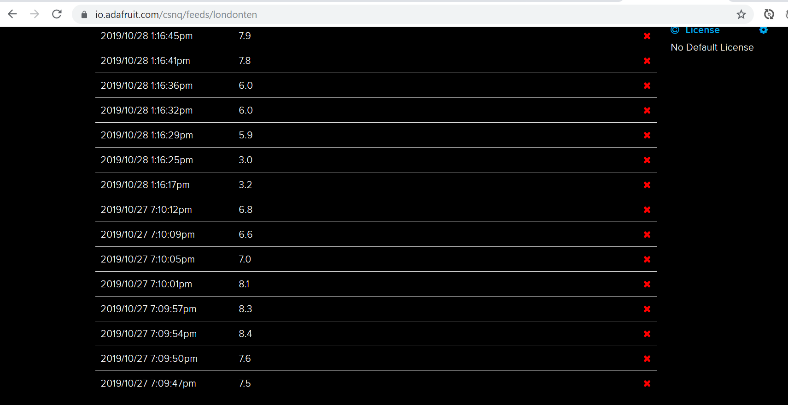

# Raspberry Pi Air Quality Monitor - New Project

## About this project
My Raspberry Pi has been sitting in a drawer neglected. I started to wonder what the air quality was like where I lived and if I could draw a correlation between that and some of my allergies. This purpose of this project is to create a portable air quality monitor that will upload PM2.5 and PM10 readings (you can find out more about them here: https://www.metoffice.gov.uk/weather/guides/air-quality ) online and display this on a page that will compare it with the general air quality readings Kings College London produces (https://www.londonair.org.uk/LondonAir/Default.aspx). 

## Current status 
I built a monitor following some guides I found online (This has been the most valuable: https://openschoolsolutions.org/measure-particulate-matter-with-a-raspberry-pi/)
and was able to upload the information to Adafruit allowing me to record and graph the results. 

The next steps are to learn how to write an API to push this data up to a website and allow anybody to view the data and compare this with the general air quality data available. 

This API could also therefore be utilised by others allowing them to submit their own readings if they have similar monitors. 

**The prototype monitor setup and functioning**

**a screenshot of the monitor spitting out the raw data** 

**screenshot of the converted data being fed to Adafruit**

## Hardware I am using
* Raspberry pi 2B (but any Pi from 2 upwards can be used)
* Nova PM Sensor SDS011 High Precision PM2.5 Air Quality Detection Sensor Module 

## Optional Hardware
* Mobile phone with 4G for tethering (So I can upload readings on the go)

## Hardware I may optionally use later
* LCD touch screen for raspberry pi

## checklist for making a demo version available
- [X] built initial monitor
- [X] create or adapt python script to get readings from the monitor 
- [ ] create an API to place the readings from the monitor into JSON format
- [ ] host the information on a website that can be viewed
- [ ] create a way to input location either manually or automatically when taking readings
- [ ] connect to Kings College air quality API to retrieve data for comparison
- [ ] add screen to make device more portable so it can be controlled in an outside environment away from a screen 

## Learning Points
* understanding elements of hardware integration
* creation of APIs
* transitioning between multiple programming languages 